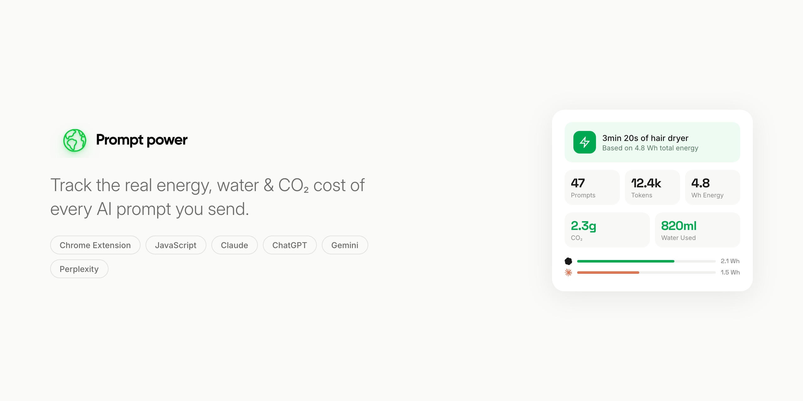

# Prompt Power

Track the real energy, water & CO₂ cost of every AI prompt you send.

**Prompt Power** is a Chrome extension that silently monitors your interactions with AI platforms and estimates the environmental impact of each prompt — energy consumed, water used for cooling, and CO₂ emitted.

## Supported Platforms

- **Claude** (claude.ai)
- **ChatGPT** (chat.openai.com / chatgpt.com)
- **Gemini** (gemini.google.com)
- **Perplexity** (perplexity.ai)

## Features

- **Real-time tracking** — Automatically detects prompts and responses as you chat
- **Energy estimation** — Calculates Wh consumed per prompt based on token count and model type
- **CO₂ emissions** — Estimates carbon footprint using US grid average (0.478g CO₂/Wh)
- **Water usage** — Tracks data center cooling water (~1ml/Wh)
- **Relatable comparisons** — Converts energy into everyday equivalents:
  - Hair dryer, microwave, refrigerator run time
  - Netflix streaming, PC gaming duration
  - Human breaths worth of CO₂
  - Tree absorption time
  - Google searches equivalent
  - Flight distance, and more
- **Platform breakdown** — See which AI platform uses the most energy
- **Usage chart** — Cumulative energy usage over time per platform
- **Recent activity** — Scrollable history of all tracked prompts
- **Dark & light themes** — Toggle between modes
- **Badge counter** — Shows prompt count on the extension icon

## How It Works

1. Content scripts on each AI platform detect when you send a prompt and receive a response
2. Token counts are estimated using a lightweight tokenizer
3. Energy is calculated based on published research data for each model's inference cost
4. Data is stored locally in Chrome storage — nothing leaves your browser

## Energy Calculations

| Metric | Formula | Source |
|--------|---------|--------|
| **Energy (Wh)** | Tokens × model-specific Wh/token | [Luccioni et al., 2023](https://arxiv.org/abs/2311.16863) |
| **Water (ml)** | Energy × 1 ml/Wh | [Shaolei Ren, UC Riverside](https://arxiv.org/abs/2304.03271) |
| **CO₂ (g)** | Energy × 0.478 g/Wh | [EPA eGRID US average](https://www.epa.gov/egrid) |

> Results are estimates based on published research and may not reflect exact real-world values. Actual consumption varies by model, data center location, hardware, and load.

## Installation

1. Clone or download this repository
2. Open Chrome and go to `chrome://extensions/`
3. Enable **Developer mode** (top right)
4. Click **Load unpacked** and select the project folder
5. Visit Claude, ChatGPT, Gemini, or Perplexity and start chatting

## Project Structure

```
prompt-power/
├── manifest.json          # Chrome extension manifest (v3)
├── background/
│   └── service-worker.js  # Badge updates on storage changes
├── content/
│   ├── claude.js          # Claude content script
│   ├── chatgpt.js         # ChatGPT content script
│   ├── gemini.js          # Gemini content script
│   └── perplexity.js      # Perplexity content script
├── lib/
│   ├── tokenizer.js       # Lightweight token estimator
│   ├── energy.js          # Energy calculation per model
│   └── comparisons.js     # Relatable energy comparisons
├── popup/
│   ├── popup.html         # Extension popup UI
│   ├── popup.css          # Styles (light + dark themes)
│   └── popup.js           # Popup logic & rendering
└── icons/
    ├── logo-light.svg     # Logo for light theme
    ├── logo-dark.svg      # Logo for dark theme
    ├── smiley.svg          # Footer smiley icon
    ├── icon16.png
    ├── icon48.png
    └── icon128.png
```

## Tech Stack

- **Vanilla JavaScript** — No frameworks, no build step
- **Chrome Extension Manifest V3** — Service worker + content scripts
- **Chrome Storage API** — Local data persistence
- **SVG charts** — Hand-built area/line chart for usage over time
- **Inter + Space Grotesk** — Typography via Google Fonts

## Privacy

All data stays local. Prompt Power does **not**:
- Send data to any server
- Track browsing activity outside supported AI platforms
- Store full prompt text (only first 100 characters as preview)
- Require any account or sign-up

## Research & References

- [Power Hungry Processing: Watts Driving the Cost of AI Deployment?](https://arxiv.org/abs/2311.16863) — Luccioni et al., 2023
- [Making AI Less Thirsty](https://arxiv.org/abs/2304.03271) — Li et al., 2023
- [EPA eGRID](https://www.epa.gov/egrid) — US electricity grid emission factors

## Author

Built by [Anmol Bhardwaj](https://anmolbhardwaj.com)

## License

MIT
